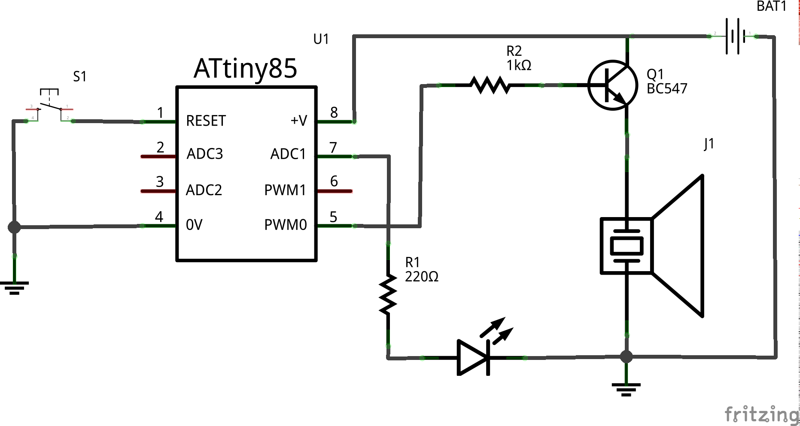

# daily_beeper

Scrum dailies too long? Set up a 1 minute timer for each member of your team.

What you need:
* ATiny85/45/25
* beeper
* breadboard
* red LED
* BC547 transistor
* 220Ohm resitor
* 1kOhm resistor
* button
* some cables
* 3V power source (CR2032 for example with a proper holder)

